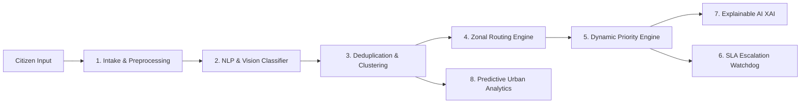

# 🏛️ CivicAI: Smart City Complaint Intelligence & Resolution Platform
> *"Report Once. Resolve Faster. Build Better Cities."*

**CivicAI** is an AI-powered, autonomous **8-Agent Civic Governance & Urban Intelligence Platform** that elevates civic grievance redressal from a simple complaint portal into an AI operating system for modern smart cities.

---

## 🌟 Key Winning Features

### 1. 📷🎤📍 Multi-Modal Intake Layer
- **Live Voice Complaint**: Multi-lingual microphone speech recognition & transcription.
- **Vision Image Recognition**: Object detection, damage severity estimation & hazard flagging.
- **GPS Auto-Pinning**: Interactive map pin picker + automated municipal ward/zone geocoding.
- **1-Click Judge Demo Scenarios**: Pre-configured real-world emergency scenarios (Water Main Burst, 11kV Live Wire at School, Ring Road Potholes, Canal Choke) for instant 1-click evaluation!
- **Omnichannel Simulators**: Interactive WhatsApp complaint chatbot and Smart Asset QR Code reporting on utility poles and bins.

### 2. 🤖 Autonomous 8-Agent Ecosystem


1. **Agent 1 (Intake & Preprocessing)**: Cleans multi-modal payloads, geocodes coordinates, formats structured cases.
2. **Agent 2 (Classification & Summarization)**: Classifies issues into Water, Electricity, Roads, Waste, Health, Transit with NLP keyword scoring and vision cues.
3. **Agent 3 (Deduplication & Spatial Vector Clustering)**: Uses Haversine geospatial proximity ($\le 350\text{m}$) + Jaccard token similarity to merge incoming duplicate reports into **"Master Cases"**, preventing duplicate government dispatches and tracking collective follower counts.
4. **Agent 4 (Smart Zonal Team Routing)**: Directs cases to specific field divisions (e.g. *Hydraulic Emergency 1A*, *High Voltage Grid Safety 2*, *Road Taskforce 3B*) with designated lead officers.
5. **Agent 5 (Dynamic Priority & Risk Engine)**:
   $$\text{Priority Score} = (\text{Urgency} \times 0.35 + \text{Impact} \times 0.25 + \text{Safety} \times 0.30 + \text{Delay} \times 0.10) \times 100$$
   - 🔴 **CRITICAL** (80-100): 6-12h SLA
   - 🟠 **HIGH** (60-79): 24-48h SLA
   - 🟡 **MEDIUM** (40-59): 48-72h SLA
   - 🟢 **LOW** (0-39): Standard queue
6. **Agent 6 (Proactive SLA Escalation)**: Monitored with a live **SLA Time-Warp Simulator**:
   - 3 Days $\rightarrow$ Field Reminder
   - 7 Days $\rightarrow$ Zonal Supervisor Escalation
   - 15 Days $\rightarrow$ Municipal Commissioner Red-Flag
7. **Agent 7 (Explainable AI Transparency)**: Plain-language transparency cards explaining *why* category, priority, and crew were chosen with confidence scores.
8. **Agent 8 (Predictive Urban Planning)**: Analyzes recurring clusters and seasonal storm patterns to predict infrastructure failures (e.g. cast-iron pipe bursts, transformer thermal overloads) *before they happen*.

---

### 3. 👥 Citizen Portal
- **Swiggy/Zomato-Style Visual Live Tracker**: Real-time status lifecycle (`Submitted` $\rightarrow$ `AI Verified` $\rightarrow$ `Dispatched` $\rightarrow$ `In Progress` $\rightarrow$ `Resolved with Proof Photo`).
- **CivicBot AI Chatbot**: Conversational reporting, status retrieval, and city emergency helplines.
- **Citizen Gamification & Karma**: Badges, reputation points, and city ward leaderboards.

---

### 4. 🏛️ Municipal Command Center
- **Executive KPI Dashboard**: Deduplication savings rate, city health index, and active critical alerts.
- **Master Case Triage & Kanban**: 1-click status transitions, crew reassignment, and supervisor certification.
- **Interactive GIS Heatmap**: Leaflet map with category filters, radius density clusters, and ward health metrics.
- **SLA Time-Warp Simulator**: Fast-forward time (+24h, +3d, +7d, +15d) to test automated escalations live.
- **Predictive Urban Analytics Hub**: Preventative work-order dispatcher for forecasted infrastructure failures.
- **XAI Inspector Modal**: Deep-dive audit into mathematical formula weights, NLP keywords, and safety heuristics.

---

## 🚀 Running the Project

### Development Server:
```bash
npm run dev
```
Open your browser at `http://localhost:5173`.

### Production Build:
```bash
npm run build
npm run preview
```

---
*Built for Innovation Hackathons & Next-Generation Civic Governance.*
